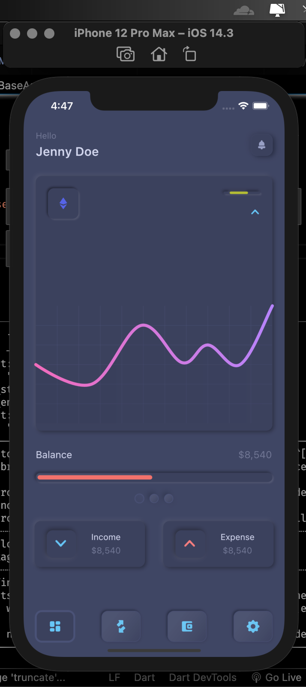
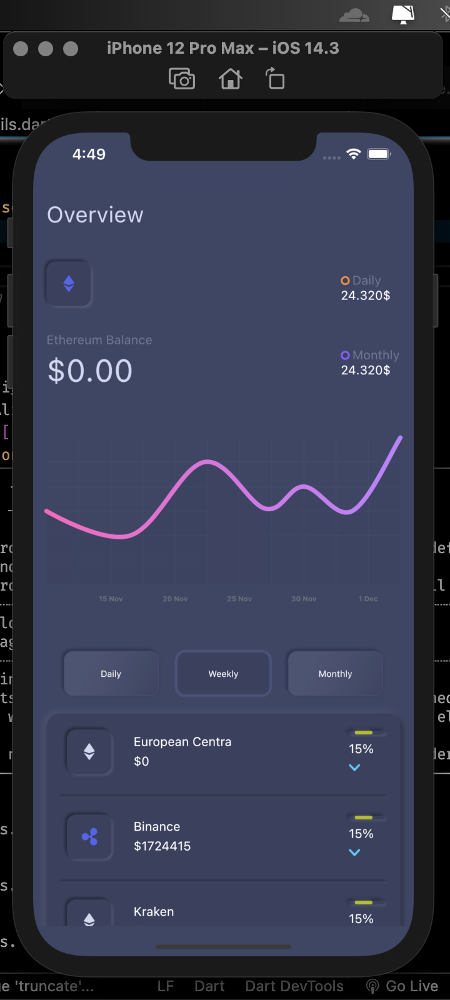

# Clypto



---

## Getting Started 🚀

This project contains 3 flavors:

- development
- staging
- production

To run the desired flavor either use the launch configuration in VSCode/Android Studio or use the following commands:

```sh
# Development
$ flutter run --flavor development --target lib/main_development.dart --no-sound-null-safety

# Staging
$ flutter run --flavor staging --target lib/main_staging.dart --no-sound-null-safety

# Production
$ flutter run --flavor production --target lib/main_production.dart --no-sound-null-safety
```

_\*Clypto works on iOS, Android, and Web._

---

## .env file required to run 🚀
To run application a .env file containing the base urls and api key needs to be added to root of the project.
.env file contents
```
API_URL=rest-sandbox.coinapi.io
API_KEY=YOUR-API-KEY

```
